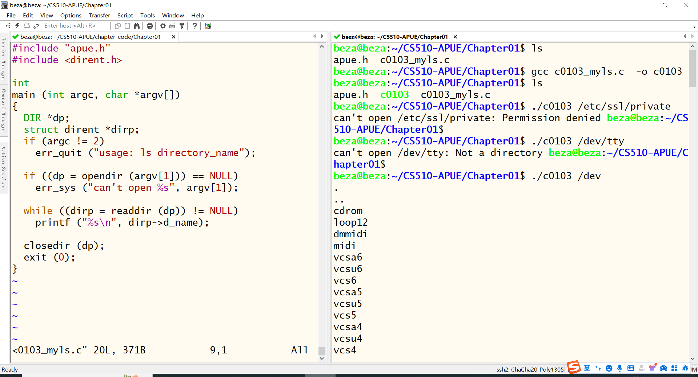
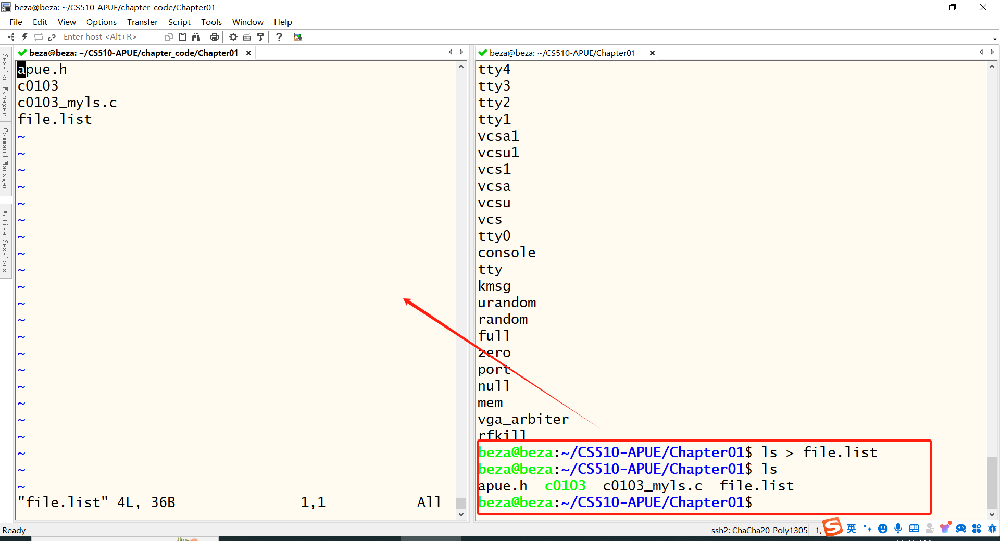
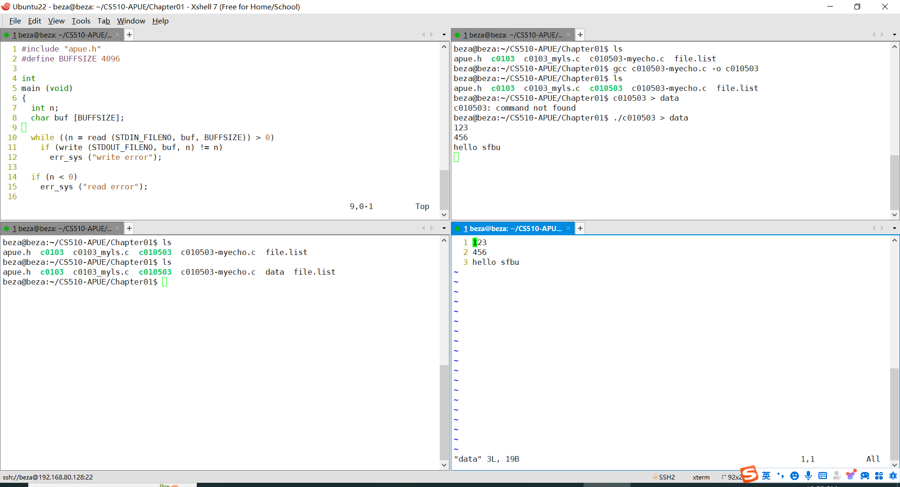
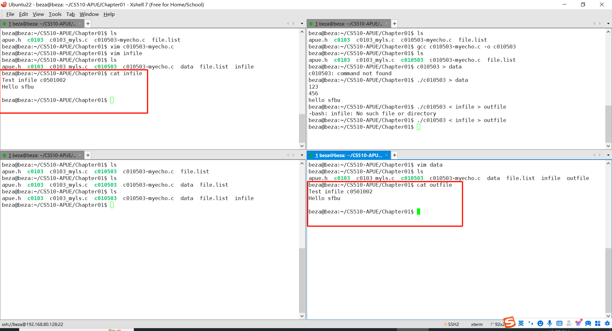
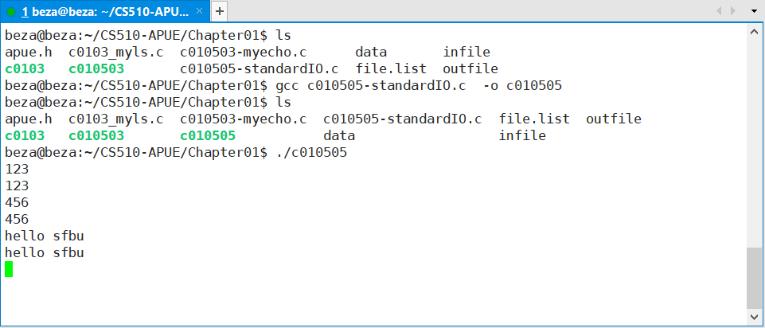
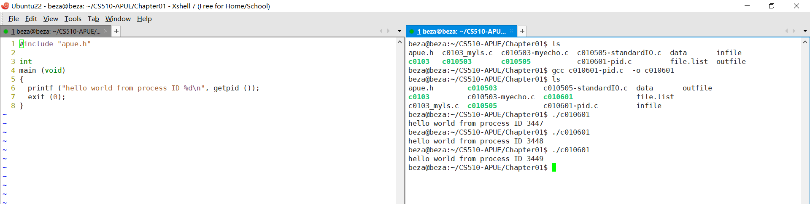
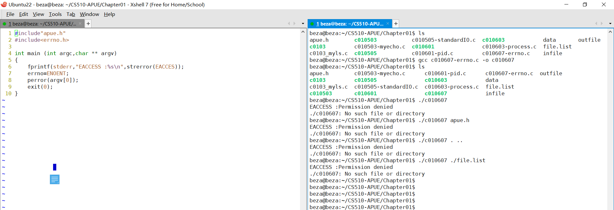
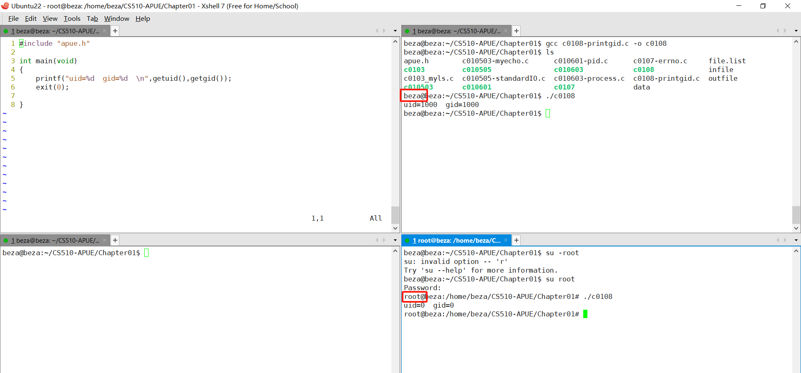
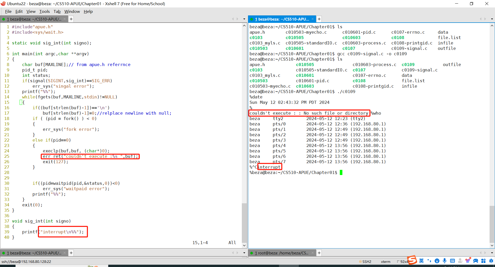
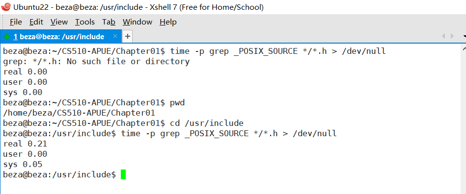

# c0103-myls.c

# c010502-file.list

# c010503-myecho.c-data

# c010503-myecho.c-outfile

****

# c010505-standardIO.c

# c010601-pid.c

# c0107-errno.c

# c0108-printgid.c

# c0109-signal.c

# c0110 time

# 