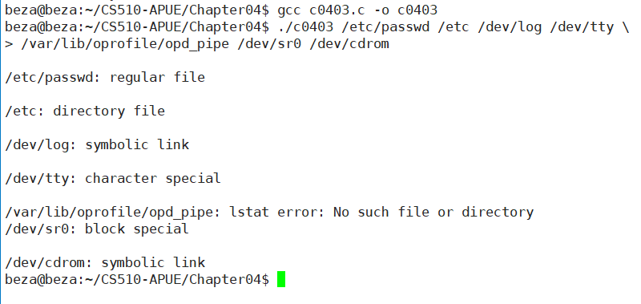
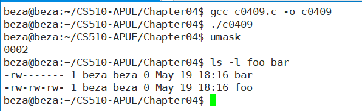
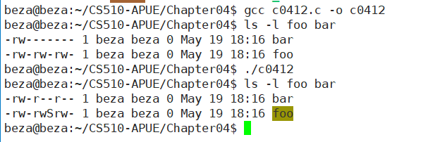
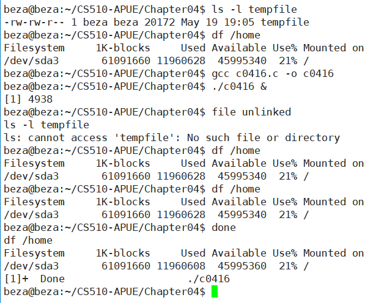
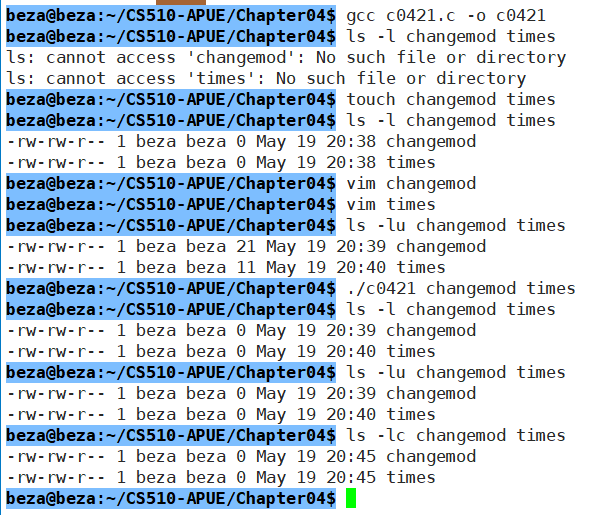
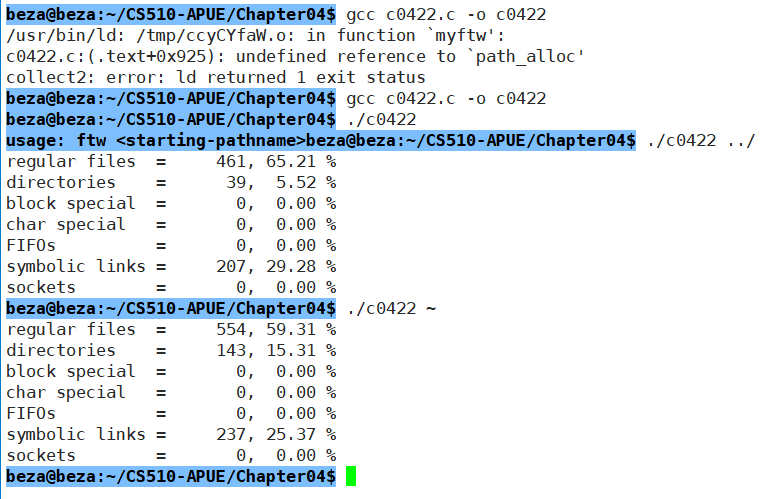
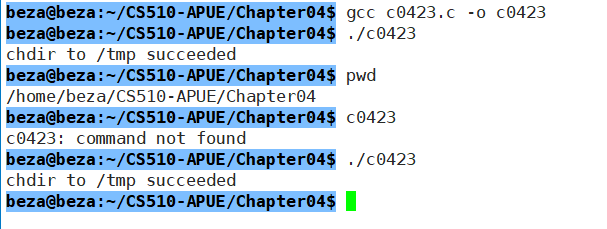
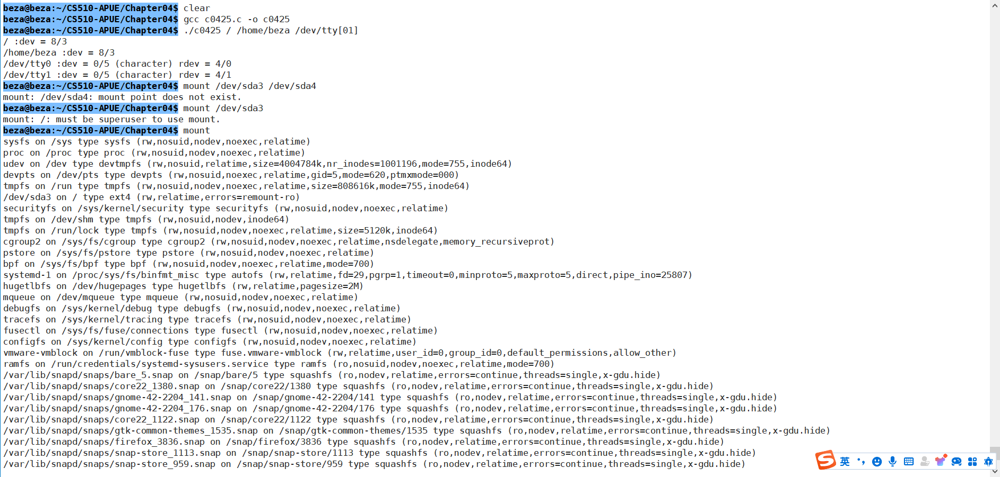
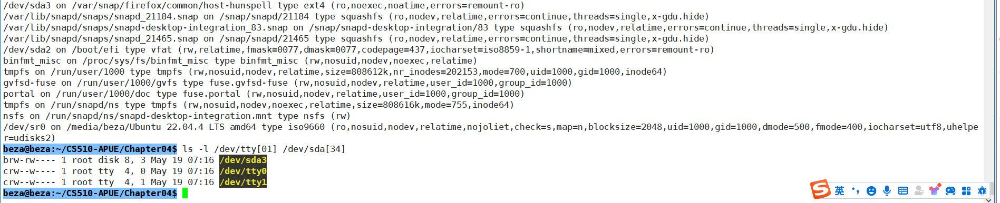

# c0403

```
./c0403 /etc/passwd /etc /dev/log /dev/tty \
> /var/lib/oprofile/opd_pipe /dev/sro /dev/cdrom
```




# c0408


# c0409




# c0412




# c0416



# c0421




# c0422




# c0423




# c0424



