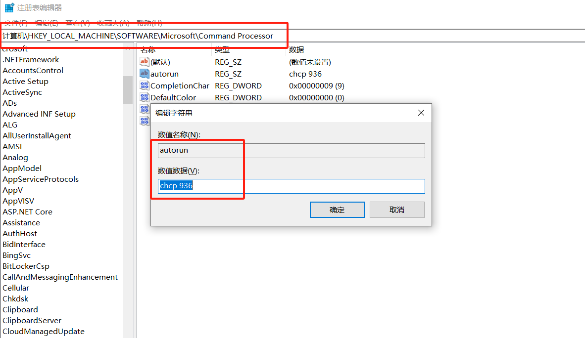
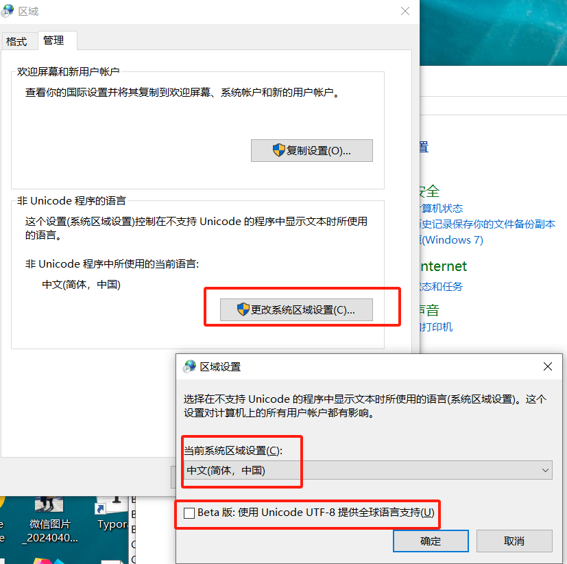
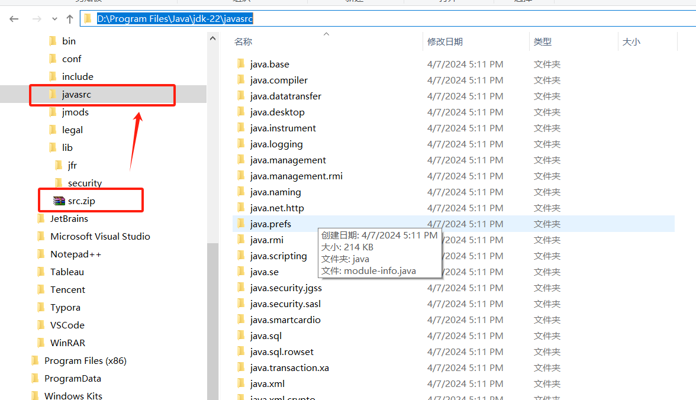
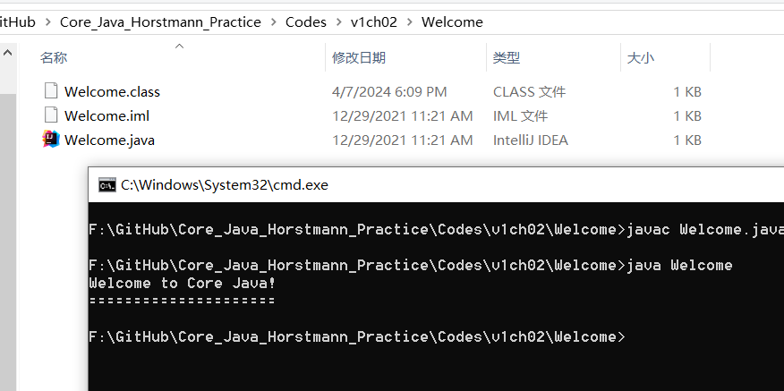
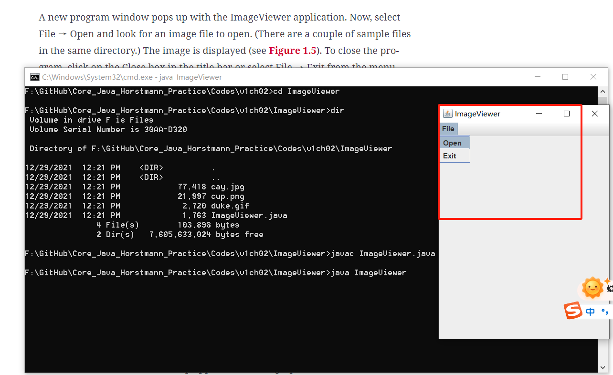

# Chapter01 An Introduction to Java

#### 0 garbled text problem in Chinese Windows





#### 1.7.3 Installing Source Files

New a folder, named as "javasrc", unzip the `src.zip` to that folder.




#### 1.7.4 Compiling and running Welcome.java

**


#### 1.7. 5  Image Viewer




#### 1.10 Jshell

```
Microsoft Windows [版本 10.0.19045.4170]
(c) Microsoft Corporation。保留所有权利。
活动代码页: 936

C:\Users\Chufeng>jshell
|  欢迎使用 JShell -- 版本 22
|  要大致了解该版本, 请键入: /help intro

jshell> "Core Java".length()
$1 ==> 9

jshell> 5* $1 - 3
$2 ==> 42

jshell> int answer = 6*7
answer ==> 42

jshell> Math.
   ...>
   ...> E
$4 ==> 2.718281828459045

jshell> Math.PI
$5 ==> 3.141592653589793

jshell>
```

