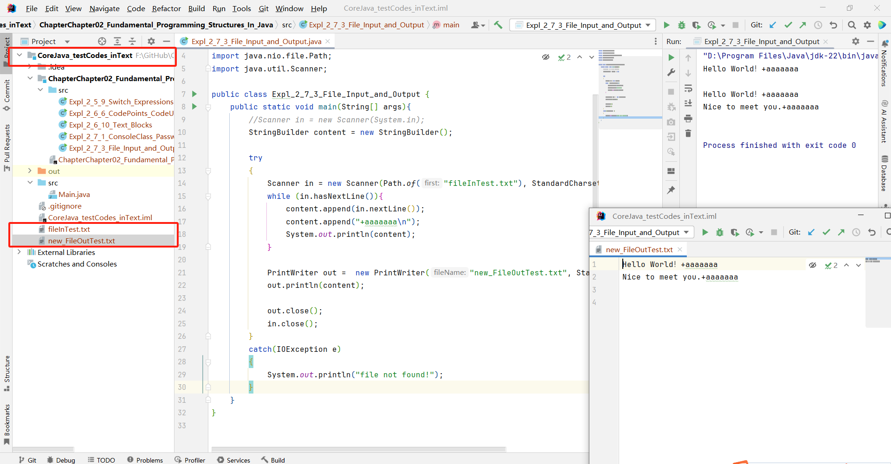
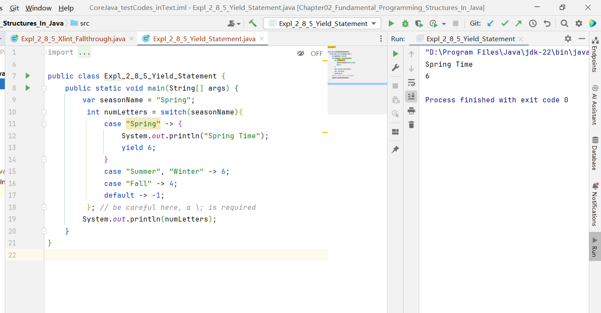

#### 2.3 Java has an arbitrary-precision arithmetic package. However, “big numbers,” as they are called, are Java objects and not a primitive Java type.


#### 2.3.2 Floating-point numbers roundoff errors

Floating-point numbers are *not* suitable for financial calculations in which roundoff errors cannot be tolerated. For example, the command System.out.println(2.0 - 1.1) prints 0.8999999999999999, not 0.9 as you would expect. Such roundoff errors are caused by the fact that floating-point numbers are represented in the binary number system. There is no precise binary representation of the fraction 1/10, just as there is no accurate representation of the fraction 1/3 in the decimal system. 

If you need precise numerical computations without roundoff errors, use the BigDecimal class.


#### 2.3.3 Unicode escape sequences are processed before the code is parsed

Unicode escape sequences are processed before the code is parsed. 

For example, “\u0022+\u0022” is *not* a string consisting of a plus sign surrounded by quotation marks (U+0022). 

Instead, the \u0022 are converted into `“` before parsing, yielding “`“`+`”`“, or an empty string.


#### 2.5.4 Cast and Round

Cast: an integer discards the fractional part. 

Round: round a floating-point number to the *nearest* integer.

```java
double x = 9.97;
int nx1 = (int) x;
int nx2 = (int) Math.round(x);

===============
nx1 = 9
nx2 = 10
```


#### 2.5.9 Switch Expressions

```java
import java.util.Scanner;

public class Expl_2_5_9_Switch_Expressions {
    public static void main(String[] args) {
        Scanner scanner = new Scanner(System.in);
        System.out.print("Please input a number from 0-3:");
        int seasonCode = scanner.nextInt();

        String seasonName = switch (seasonCode){
            case 0 -> "Spring";
            case 1 -> "Summer";
            case 2 -> "Fall";
            case 3 -> "Winter";
            default -> "???";
        };

        System.out.println("The season is: " + seasonName);
        scanner.close();
    }
}
```


#### 2.6.6 Code Points and Code Units


> **char**：*Java* 中，*char*类型为16个二进制位，原本用于表示一个字符。但后来发现，16位已经不够表示所有的字符，所以后来发展出了代码点表示字符的方法。
>
> **代码点(code point)**：是指编码字符集中，字符所对应的数字。有效范围从**U+0000**到**U+10FFFF**。其中**U+0000**到**U+FFFF**为基本字符，**U+10000**到**U+10FFFF** 为增补字符。
>
> **代码单元(code unit)**：对代码点进行编码得到的**1**或**2**个16位序列。其中**基本字符**的代码点直接用一个相同值的代码单元表示，**增补字符**的代码点用两个代码单元的进行编码，这个范围内没有数字用于表示字符，因此程序可以识别出当前字符是单单元的基本字符，还是双单元的增补字符。

```java
public class Expl_2_6_6_CodePoints_CodeUnits {
    // Method to convert the string "U+XXXXX" to the corresponding character
    public static String codePointToString(String codePoint) {
        int cp = Integer.parseInt(codePoint.substring(2), 16);
        return new String(Character.toChars(cp));
    }

    public static void main(String[] args) {
        String greeting = "\uD835\uDD46 is the set of octonions";
        System.out.println(greeting);

        int n = greeting.length(); //26
        int cpCount = greeting.codePointCount(0,greeting.length()); //25

        char first =  greeting.charAt(4); //s
        char last = greeting.charAt(25); //s

        int index = greeting.offsetByCodePoints(0,24); //1
        int cp = greeting.codePointAt(index); //32

        String cpchar= codePointToString("U+1D546");

        System.out.println("greeting.length->n: " + n);
        System.out.println("greeting.codePointCount->cpCount: " + cpCount);
        System.out.println("first: " + first);
        System.out.println("last: " + last);
        System.out.println("index: " + index);
        System.out.println("cp: " + cp);
        System.out.println("cpchar: " + cpchar); //𝕆

        //////////////////////////////////////////////////////

        System.out.println("--------------------------------");
        String sentence = "\u03C0 \uD835\uDD6B";    // the index 1 is a space

        System.out.println(sentence);
        int lengthU = sentence.length();
        System.out.println("lengthU: " + lengthU);        // 4 code units
        int lengthP = sentence.codePointCount(0, lengthU);
        System.out.println("lengthP: " + lengthP);        // 3 code points
        int n2 = sentence.length(); //
        System.out.println("sentence.length->n: " + n2);
        int cpCount2 = sentence.codePointCount(0,sentence.length()); //
        System.out.println("sentence.codePointCount->cpCount: " + cpCount2);

        char first2 =  sentence.charAt(0); // change the number to see different results
        char last2 = sentence.charAt(2); //s
        System.out.println("first2: " + first2);
        System.out.println("last2: " + last2);


        int index2 = sentence.offsetByCodePoints(0,2); //2
        int cp2 = sentence.codePointAt(index2); //dec:120171 -> hex utf32: 1D56B = utf-16 0xD835 0xDD6B
        System.out.println("index2: " + index2);
        System.out.println("cp2: " + cp2); // U+1D56B

    }
}
```


#### 2.6.10 Text Blocks

```java
public class Expl_2_6_10_Text_Blocks {
    public static void main(String[] args) {
        String greeting = """
                Hello
                World
                """; // "Hello\nWorld\n"
        System.out.println(greeting);


        String prompt = """
                Hello, my name is Chufeng.
                Please enter your name:
                """;
        System.out.println(prompt);

        String prompt1 = """
                Hello, my name is Chufeng. \
                Please enter your name:
                """;
        System.out.println(prompt1);

        String html= """
                <div class = "Warning">
                    Beware of those who say "Hello" to the world
                </div>
                """;
        System.out.println(html);


    }
}
```


#### 2.7.1 Console class for passwords

```java
import java.io.Console;
import java.util.Scanner;

public class Expl_2_7_1_ConsoleClass_Passwords {
    public static void main(String[] args) {
        Scanner in = new Scanner(System.in);

        // get first input
        System.out.print("What is your name?");
        String name = in.nextLine();

        // get second input
        System.out.print("How old are you?");
        int age = in.nextInt();

        // display output to console
        System.out.println("Hello, " + name + ". New year you will be " + (age + 1));

        Console  cons = System.console();
        if(cons != null)
        {
            System.out.print("User Name：");
            String username = cons.readLine();

            System.out.print("Password: ");
            char[] passwd = cons.readPassword();
        }
        else
        {
            System.out.println("Console object is null");
        }
    }
}
```


#### 2.7.3 File Input and Output

```java
import java.io.IOException;
import java.io.PrintWriter;
import java.nio.charset.StandardCharsets;
import java.nio.file.Path;
import java.util.Scanner;

public class Expl_2_7_3_File_Input_and_Output {
    public static void main(String[] args){
        //Scanner in = new Scanner(System.in);
        StringBuilder content = new StringBuilder();

        try
        {
            Scanner in = new Scanner(Path.of("fileInTest.txt"), StandardCharsets.UTF_8);
            while (in.hasNextLine()){
                content.append(in.nextLine());
                content.append("+aaaaaaa\n");
                System.out.println(content);
            }

            PrintWriter out =  new PrintWriter("new_FileOutTest.txt", StandardCharsets.UTF_8);
            out.println(content);

            out.close();
            in.close();
        }
        catch(IOException e)
        {
            System.out.println("file not found!");
        }
    }
}
```


**The path of the file is under the root of the project, rather than the module package.**





#### 2.8.5 -Xlint:fallthrough 

```java
import java.io.IOException;
import java.io.PrintWriter;
import java.nio.charset.StandardCharsets;
import java.nio.file.Path;
import java.util.Scanner;

public class Expl_2_8_5_Xlint_Fallthrough {
    private static String CONDITION = "CONDITION";
    // compile with javac -Xlint:fallthrough
    // In IntelliJ: Settings > Build, Execution, Deployment > Compiler > Java Compiler > Additional

    @SuppressWarnings("fallthrough")
    public static void main(String[] args) {
        String condition = "CONDITION 2";
        String result;
        switch (condition) {
            case "CONDITION 1":
                result = CONDITION + " " + 1;
            case "CONDITION 2":
                result = CONDITION + " " + 2;
            case "CONDITION 3":
                result = CONDITION + " " + 3;
                break;
            case "CONDITION 4":
                result = CONDITION + " " + 4;
                break;
            default:
                result = CONDITION + " DEFAULT";
        }
        System.out.println(result);
    }
}

```


#### `2.8.5` Switch Statement - Yield keyword

```java
import java.io.IOException;
import java.io.PrintWriter;
import java.nio.charset.StandardCharsets;
import java.nio.file.Path;
import java.util.Scanner;

public class Expl_2_8_5_Yield_Statement {
    public static void main(String[] args) {
        var seasonName = "Spring";
         int numLetters = switch(seasonName){
             case "Spring" -> {
                 System.out.println("Spring Time");
                 yield 6;
             }
             case "Summer", "Winter" -> 6;
             case "Fall" -> 4;
             default -> -1;
         }; // be careful here, a \; is required
        System.out.println(numLetters);
    }
}
```


