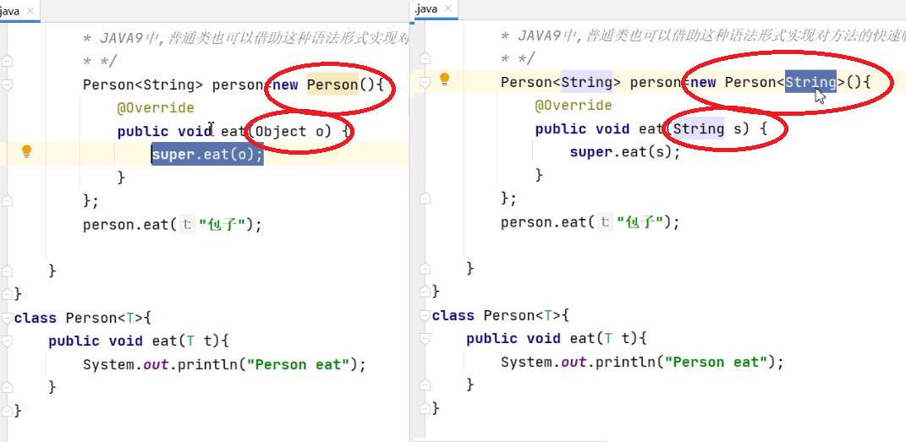

# JDK各个版本特性讲解-JDK9特性

> lecture：波哥


# 一、JDK版本特性

&emsp;&emsp;JAVA8 及之前,版本都是特性驱动的版本更新,就是有重大的特性产生,然后进行更新

&emsp;&emsp;JAVA9开始,JDK开始以时间为驱动进行更新,以半年为周期,到时即更新,三年出一个长期支持版,其他都是短暂的版本

&emsp;&emsp;目前的长期支持版有 JAVA8  JAVA11 和JAVA17,这些版本大家注意在将来的工作中使用的概率更高,也就是说我们将来研发,使用JAVA11 ,然后使用JAVA17 是必然的,只是一个时间的问题

&emsp;&emsp;新的长期支持版每三年发布一次,根据后续的发布计划,下一个长期支持的版本JAVA17于2021年发布

环境准备：

> 下载JDK,可以通过[https://www.injdk.cn/](https://www.injdk.cn/) 去下载各种不同版本的JDK, 因为JDK是向下兼容的,所以我们使用一个较新的JDK,就可以去测试和学习从9-最新所有版本的新特征了,我们这里以安装openjdk19为例,下载安装JDK19的压缩包


下载后可以解压到我们磁盘的任意位置,我这里的位置是 D:\software\openjdk-19.0.1_windows-x64_bin\jdk-19.0.1


在IDEA中创建项目。可以选择对应的JDK


当然,也可以在项目创建完毕之后,更换JDK为19

# 二、JDK9特性讲解

## 1. JDK9特性概述

&emsp;&emsp;经过4次推迟，历经曲折的Java9最终在2017年9月21日发布。因为里面加入的模块化系统，在最初设想的时候并没有想过那么复杂，花费的时间超出预估时间。距离java8大约三年时间。
&emsp;&emsp;Java 9提供了超过150项新功能特性，包括备受期待的模块化系统、可交互的REPL工具: jshell, JDK编译工具，语法层面的改变：Java公共API和私有代码，以及安全增强、扩展提升、性能管理改善等。可以说Java 9是一个庞大的系统工程，完全做了一个整体改变。
&emsp;&emsp;但是这个巨大改变的功劳，都给了java11了，目前oracle对8,11都长期支持，9,10不支持了，只能从历史版本（[http://jdk.java.net/](http://jdk.java.net/)）中下载，Java 11 将会获得 Oracle 提供的长期支持服务，直至2026年9月。
&emsp;&emsp;从Java9这个版本开始，Java 的计划发布周期是6个月，下一个Java的主版本将于2018年3月发布，命名为Java18.3(java10)， 紧接着再过六个月将发布Java18.9(java11).
&emsp;&emsp;这意味着Java的更新从传统的以特性驱动的发布周期，转变为以时间驱动的(6个月为周期)发布模式**（更快的时间周期,oracle的理念就是小步快跑，快速迭代，像IBM（DB2数据库，保守型内部测试才投入市场）），并逐步的将Oracle JDK原商业特性进行开源。针对企业客户的需求，Oracle将以三年为周期发布长期支持版本(long term support)

## 2. JDK9的改变

JDK9的具体变化在下面的思维导图中呈现：


官方提供的新特性的列表

[https://docs.oracle.com/javase/9/whatsnew/toc.htm#JSNEW-GUID-C23AFD78-C777-460B-8ACE-58BE5EA681F6](https://docs.oracle.com/javase/9/whatsnew/toc.htm#JSNEW-GUID-C23AFD78-C777-460B-8ACE-58BE5EA681F6)

openJDK  可参考源码

[http://openjdk.java.net/projects/jdk9/](http://openjdk.java.net/projects/jdk9/)

在线 OracleJDK Documentation 在线文档

[https://docs.oracle.com/javase/9/](https://docs.oracle.com/javase/9/)

## 3. JDK和JRE目录变化

&emsp;&emsp;然后我们来看看JDK和JRE在JDK8和JDK9的差异


目录作用介绍：

> bin 包含命令行开发和调试工具 如javac jar  javadoc
>
> include 包含编译本地代码时使用的c/c++头部文件
>
> lib 包含JDK工具的几个jar和其他类型的文件,他有一个tools.jar文件,其中含javac编译器的java类
>
> jre/bin目录 包含基本指令,如java指令,在windows平台上,它包含系统的运行时动态链接
>
> jre/lib包含用户可编辑的配置文件,如properties和.policy文件,包含几个jar文件,rt.jar文件包含运行时的java类和资源文件


目录介绍：

> bin 包含所有指令,在windows平台上,他继续包含系统的运行时动态链接
>
> conf目录 包含用户可编辑的配置文件,例如之前位于jre/lib目录中的.properties和policy
>
> includes 包含在以前编译本地代码时使用c/c++头文件,他只存在于JDK中
>
> jmods  包含JMOD格式的平台模块,创建自定义运行时映像需要他,它只存在于jdk中
>
> legal 法律声明
>
> lib 包含非windows平台上的动态链接本地库,其子目录和文件不应由开发人员直接编译或使用
>
> 从9开始以后的JDK目录结构都是如此

## 4. 语法层次改变

### 4.1 钻石操作符号语法升级

**钻石操作符**,就是我们泛型使用的符号&#x3c;>

JAVA8 中,匿名内部类不能使用钻石操作符,如下代码在JAVA8 中是报错的,匿名内部类这里不支持泛型推断,重写的方法不明确泛型


这里匿名内部类中的&#x3c;>号里必须要和前面的声明保持一致,不能空着不写,这样重写的方法就根据匿名内部类的泛型


但是这种写法在JAVA9 中就允许了


而且在JAVA9中,匿名内部类的语法不仅仅可以用于接口和抽象类,普通类也可以通过匿名内部类写法,在某个实例上完成对某个方法的重写

```java
public class Demo1 {
    public static void main(String[] args) {
        /*
        * 匿名内部类仅仅在接口和抽象类上使用,作为一种快速的实现方式
        * JAVA9中,普通类也可以借助这种语法形式实现对方法的快速临时的重写
        * */
        Person<String> person=new Person<>(){
            @Override
            public void eat(String s) {
                super.eat(s);
            }
        };
        person.eat("油条");

    }
}
class Person<T>{
    public void eat(T t){
        System.out.println("Person eat");
    }
}
```




### 4.2 try结构语法升级

普通的try catch finally语句  要释放的资源可以放到finally语句块中

```java
public class Demo02 {
    public static void main(String[] args) {
        InputStreamReader reader =null;
        try{
            reader =new InputStreamReader(System.in);
            int read = reader.read();
        }catch (Exception e){
            throw new RuntimeException(e);
        }finally {
            // 这里可以释放资源
            if(null != reader){
                try {
                    reader.close();
                } catch (IOException e) {
                    e.printStackTrace();
                }
            }
        }
    }
}
```

JAVA 8中已经对try语法进行了升级,可以将要释放的资源放到try后面的小括号中,这样就不用通过finally语句块释放资源了,**但是要求执行后必须关闭的资源一定要放在try子句中进行初始化,否则编译不通过.** 下面的案例中,reader必须放在try后面的小括号中进行初始化

```java
    public static void main(String[] args) {
        try( InputStreamReader reader=new InputStreamReader(System.in) ){
            int read = reader.read();
        }catch (Exception e){
            throw new RuntimeException(e);
        }
    }
```

JAVA 9 资源的关闭操作,我们可以在try子句中使用已经初始化的资源但是此时的资源必须 是final修饰的,final可以省略不写

```java
    // JAVA9 try语法升级
    public void testb() throws FileNotFoundException {
        // JAVA9 try catch finally语句块
        InputStreamReader isr =new InputStreamReader(new FileInputStream("d:/UserMapper.xml"));
        OutputStreamWriter isw =new OutputStreamWriter(new FileOutputStream("d:/UserMapper1.xml"));
        try( isr; isw){
            isr.read();
        }catch (Exception e){
            e.printStackTrace();
        }
    }
```

### 4.3 下划线命名标识符的使用限制

标识符命名组成：字母，数字，下划线，美元符

JAVA8 中,可以使用一个 _ 作为标识符的命名


JAVA9 中,就不可以使用一个_ 作为标识符的命名了,不通过编译,但是标识符中仍然可以使用_,必须配合其他内容


小细节：注意一下即可,一般也没人直接单独用一个_ 作为标识符的命名

## 5. API层次的改变

### 5.1 接口中的私有方法

&emsp;&emsp;接口中的设计使用在JDK789中都有相关的变化的。

> JAVA7 中,接口只能有抽象方法
>
> JAVA8 中,接口中static(静态不可重写)和default(可以重写)修饰的方法可以拥有方法体
>
> JAVA9 中,接口中可以使用private修饰方法,并拥有方法体,但是接口中的成员变量仍然不能用private修饰
>
> 感觉: 接口中的代码越来越靠近抽象类,但是仍然是支持多继承的


代码案例

```java
public class Demo4 {
    // 接口,是一种规范和要求
    // 实现多继承
}

// java7 接口中的方法必须都是抽象的
interface Inter1 {
    void methoda();
}

// java8接口可以定义static/default修饰的非抽象方法
interface Inter2 {
    void methoda();

    static void methodB() {

    }

    default void methodC() {

    }
}

// java9 允许定义私有的非抽象方法
interface Inter3 {
    void methoda();

    static void methodB() {

    }

    default void methodC() {
        methodD();
    }

    private void methodD() {

    }
}
```

### 5.2 String底层存储结构变化

&emsp;&emsp;JAVA8 中的String源码，String类内部维护的是一个final修饰的私有char数组,说明String的底层是通过char数组存储字符串的。


&emsp;&emsp;JAVA9 中String的源码，String类内部维护的是一个final修饰的私有byte数组,说明String的底层是通过byte数组存储字符串的.


这么调整的原因:

> 大多数String对象只包含latin-1字符。 这样的字符只需要一个字节的存储空间，因此这样的String对象的内部字符数组中有一半的空间没有使用 , 我们建议将String类的内部表示形式从UTF-16字符数组更改为一个字节数组加上一个结束编码标志字段

### 5.3 Stream新增4个API

&emsp;&emsp;JAVA9 中,Stream接口添加了4个新方法,takeWhile,dropWhile,ofNullable,还有一个iterate 方法的新重载方法,可以通过一个Predicate来指定什么时候结束迭代.

```java
/**
     * 测试Stream新增takeWhile方法
     * takeWhile  从流中的头开始取元素,直到不满足条件为止
     */
    public static void testTakeWhile(){
         List<Integer> list = Arrays.asList(1, 89, 63, 45, 72, 65, 41, 65, 82, 35, 95, 100);
        // 从头开始取所有奇数,直到遇见一个偶数为止
        list.stream().takeWhile(e-> e%2==1).forEach(System.out::println);

    }

    /**
     * 测试Stream新增dropWhile方法
     * dropWhile  从头开始删除满足条件的数据,直到遇见第一个不满足的位置,并保留剩余元素
     */
    public static void testDropWhile(){
        List<Integer> list = Arrays.asList(2, 86, 63, 45, 72, 65, 41, 65, 82, 35, 95, 100);
        // 删除流开头所有的偶数,直到遇见奇数为止
        list.stream().dropWhile(e-> e%2==0 ).forEach(System.out::println);

    }

    /**
     * 测试Stream新增ofNullable方法
     * ofNullable 允许创建Stream流时,只放入一个null
     */
    public static void testOfNullable(){
        // of方法获取流 ,允许元素中有多个null值
        Stream<Integer> stream1 = Stream.of(10, 20, 30, null);
        // 如果元素中只有一个null,是不允许的
        Stream<Integer> stream2 = Stream.of(null);
        // JAVA9中,如果元素为null,返回的是一个空Stream,如果不为null,返回一个只有一个元素的Stream
        Stream<Integer> stream3 = Stream.ofNullable(null);
    }

    /**
     * 测试Stream新增iterate方法
     * iterate指定种子数,指定条件和迭代方式来获取流
     */
    public static void testNewIterate(){
        //JAVA8通过 generate方法获取一个Stream
        Stream.generate(Math::random).limit(10).forEach(System.out::println);
        //JAVA8 通过iterate获取一个Stream
        Stream.iterate(0,t-> t+2).limit(10).forEach(System.out::println);
        //JAVA9通过重载iterate获取Stream
        Stream.iterate(0,t -> t<10,t-> t+1).forEach(System.out::println);
    }
```

&emsp;&emsp;除了Stream本身的扩展,Optional和Stream之间的结合也得到了改进,现在可以通过Optional的新方法将一个Optional对象转换为一个Stream对象(可能是空的)

```java
    /**
     * Optional类新增Stream方法,可以将一个Optional转换为Stream
     */
    public static void testOptionalStream(){
        List<Integer> list =new ArrayList<>();
        Collections.addAll(list,10,5,45,95,36,85,47);
        Optional<List<Integer>> optional=Optional.ofNullable(list);

        // 通过optional的Stream方法获取一个Stream
        Stream<List<Integer>> stream = optional.stream();
        // 以为内部的每个元素也是一个List,通过flatMap方法,将内部的List转换为Stream后再放入一个大Stream
        stream.flatMap(x->x.stream()).forEach(System.out::println);

    }
```

### 5.4 InputStream新增transferTo方法

&emsp;&emsp;InputStream新增transferTo方法,可以用来将数据直接传输到OutpuStream,这是在处理原始数据时非常常见的一种方法

```java
        InputStream inputStream =new FileInputStream("d:/aaa.txt");
        OutputStream outputStream=new FileOutputStream("d:/bbb.txt");
        try (inputStream;outputStream){
            inputStream.transferTo(outputStream);
        } catch (IOException e) {
            e.printStackTrace();
        }
```

### 5.5 只读集合创建

&emsp;&emsp;JAVA8 要创建一个只读,不可改变的集合,必须构造和分配他,然后添加元素,然后再包装成一个不可修的集合.

```java
        List<String> list= new ArrayList<>();
        list.add("Tom");
        list.add("Jerry");
        list.add("Mark");
        list.add("Jhon");
        list = Collections.unmodifiableList(list);
        System.out.println(list);
```

&emsp;&emsp;放入数据后,然后要通过unmodifiableList才能让集合变为只读集合,不能表达为单个的表达式

JAVA9 通过集合工厂方法,创建一个只读集合,只要通过新增的of方法即可完成创建.

```java
    public static void main(String[] args) {
        List<String> list = List.of("张三", "李四", "王五");
        System.out.println(list);
        list.set(0,"aaa");
        System.out.println(list);
    }
```


上面是List接口的of方法, 同样的,Set接口和Map接口下也新增了of方法,也是返回一个只读集合

## 6. 其他变化

### 6.1 模块化

&emsp;&emsp;谈到Java9大家往往第一个想到的就是Jigsaw项目（后改名为Modularity）。众所周知，Java已经发展超过20年(95年最初发布)，Java和相关生态在不断丰富的同时也越来越暴露出一些问题:

1. Java运行环境的膨胀和臃肿。**每次JVM启动的时候，至少会有30~ 60MB的内存加载，主要原因是JVM需要加载rt.jar**,不管其中的类是否被classloader加载，第一步整个jar都会被JVM加载到内存当中去(而模块化可以根据模块的需要加载程序运行需要的class)
2. 当代码库越来越大，创建复杂，盘根错节的“意大利面条式代码”的几率呈指数级的增长。不同版本的类库交叉依赖导致让人头疼的问题，这些都阻碍了Java 开发和运行效率的提升。
3. 很难真正地对代码进行封装,而系统并没有对不同部分(也就是JAR文件)之间的依赖关系有个明确的概念。每一个公共类都可以被类路径之下任何其它的公共类所访问到，这样就会导致无意中使用了并不想被公开访问的API.

&emsp;&emsp;本质上讲，模块化，就是在package外面包裹一层->>>说白了项目下有众多 模块
进行项目管理，管理各个模块，比如一个电商项目  下面有支付模块 购物模块，，，模块跟模块之间相互调用，这样代码就更安全，可以指定哪些暴露 哪些隐藏！

&emsp;&emsp;模块之间的可访问性是所使用的模块和使用模块之间的双向协议：模块明确地使其公共类型可供其他模块使用，而且使用这些公共类型的模块明确声明对第一个模块的依赖，模块中所有未导出的软件包都是模块的私有的，他们不能在模块之外使用.之前做不到，现在可以考虑这个事了.

案例演示：

创建一个普通的Java项目


然后在这个项目下准备两个模块。


然后在JDK19Module1中添加一些类就可以了


然后我们需要考虑如何在JDK19module2中使用这个类? 或者说是使用模块1中的类,第一步,在两个模块的src下创建各自的module-info.java


创建完毕的结构为：


在JDK19Module1的module-info.java文件中。设置哪些包可以向外暴露


然后在JDK19Module2的module-info.java中引入模块2


但是发现报错了,原因是,我们要把模块1添加为模块2的运行环境,具体操作如下

project structure > modules > JDK19Module2>dependencies  >>+module lib > JDK19Module1> apply >>ok


这个是时候,我们在模块2中就可以使用模块1 中的类了


### 6.2 可交互的REPL工具

&emsp;&emsp;像Python和Scala 之类的语言早就有交互式编程环境REPL (read -evaluate - print -loop)了，以交互式的方式对语句和表达式进行求值。开发者只需要输入一些代码，就可以在编译前获得对程序的反馈。而之前的Java 版本要想执行代码，必须创建文件、声明类、提供测试方法方可实现。

> 要想实现REPL，需要一个命令：JShell命令（linux中是shell命令，java中的shell命令）


&emsp;&emsp;将环境变量配置为java9，就可以在控制命令台使用jshell命令了：如果电脑上安装了其他版本的JDK,环境变量也是其他版本,大家可以在dos上通过cd 切换到指定版本的bin目录下,就可以使用该版本的jshell了.


简单的输出语句


变量定义：


方法定义和调用


导包处理


&emsp;&emsp;其实jshell中有默认的导入一些包（除了java.lang之外，以下包也可以直接用），可以直接使用不用导包，查看有哪些：


常用命令


上面操作的代码关闭窗口后就消失了。如果我们需要持久化相关的代码，也可以操作


退出jshell

```shell
/exit
```
