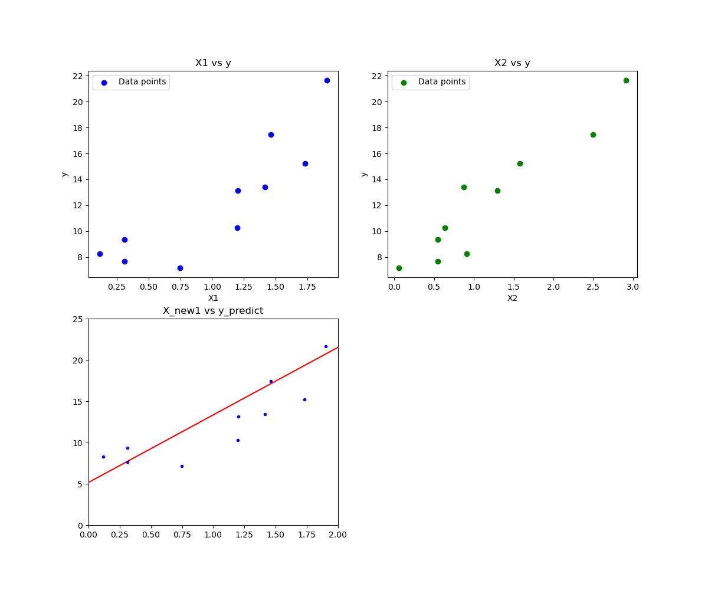

```
import numpy as np
import matplotlib.pyplot as plt

np.random.seed(42)

X1 = 2*np.random.rand(10, 1)
print("X1:\n", X1)
X2 = 3*np.random.rand(10, 1)
print("\nX2:\n", X2)
# 这里要模拟出来的数据y是代表真实的数据，所以也就是y_hat+error
y = 5 + 4*X1 + 3*X2 + np.random.randn(10, 1)
print("\ny:\n", y)

# 绘图进行展示真实的数据点和我们预测用的模型
plt.figure(figsize=(12, 10))

# 绘制 X1 vs y 的散点图
plt.subplot(2, 2, 1)
plt.scatter(X1, y, color='blue', label='Data points')
plt.xlabel('X1')
plt.ylabel('y')
plt.title('X1 vs y')
plt.legend()

# 绘制 X2 vs y 的散点图
plt.subplot(2, 2, 2)
plt.scatter(X2, y, color='green', label='Data points')
plt.xlabel('X2')
plt.ylabel('y')
plt.title('X2 vs y')
plt.legend()

# 为了去求解W0截距项，我们给X矩阵一开始加上一列全为1的X0
# X_b是经过扩展后的特征矩阵，它包含了一个常数列（通常是全为 1 的列）以及原始特征X1和X2。这样做是为了包括截距项在线性回归模型中。
X_b = np.c_[np.ones((10, 1)), X1, X2]
print("\nX_b:\n", X_b)

# 实现解析解的公式来求解θ
θ = np.linalg.inv(X_b.T.dot(X_b)).dot(X_b.T).dot(y)
print("\nθ:\n", θ)

# 使用模型去做预测
X_new = np.array([[0, 0],
                  [2, 3]])

X_new_b = np.c_[np.ones((2, 1)), X_new]

print("\nX_new_b:\n",X_new_b)

y_predict = X_new_b.dot(θ)
print("\ny_predict:\n",y_predict)

# 绘图进行展示真实的数据点和我们预测用的模型
plt.subplot(2, 2, 3)
plt.plot(X_new[:, 0], y_predict, 'r-')
plt.plot(X1, y, 'b.')
plt.axis([0, 2, 0, 25])
plt.title('X1 vs y_predict')
plt.show()
```


```
X1:
 [[0.74908024]
 [1.90142861]
 [1.46398788]
 [1.19731697]
 [0.31203728]
 [0.31198904]
 [0.11616722]
 [1.73235229]
 [1.20223002]
 [1.41614516]]

X2:
 [[0.06175348]
 [2.90972956]
 [2.49732792]
 [0.63701733]
 [0.5454749 ]
 [0.55021353]
 [0.91272673]
 [1.57426929]
 [1.29583506]
 [0.87368742]]

y:
 [[ 7.16875028]
 [21.64915045]
 [17.43991123]
 [10.28801617]
 [ 9.3502226 ]
 [ 7.67282045]
 [ 8.27037729]
 [15.22746886]
 [13.15204254]
 [13.39656547]]

X_b:
 [[1.         0.74908024 0.06175348]
 [1.         1.90142861 2.90972956]
 [1.         1.46398788 2.49732792]
 [1.         1.19731697 0.63701733]
 [1.         0.31203728 0.5454749 ]
 [1.         0.31198904 0.55021353]
 [1.         0.11616722 0.91272673]
 [1.         1.73235229 1.57426929]
 [1.         1.20223002 1.29583506]
 [1.         1.41614516 0.87368742]]

θ:
 [[5.1666836 ]
 [2.92709129]
 [3.49962994]]

X_new_b:
 [[1. 0. 0.]
 [1. 2. 3.]]

y_predict:
 [[ 5.1666836 ]
 [21.51975601]]
```




